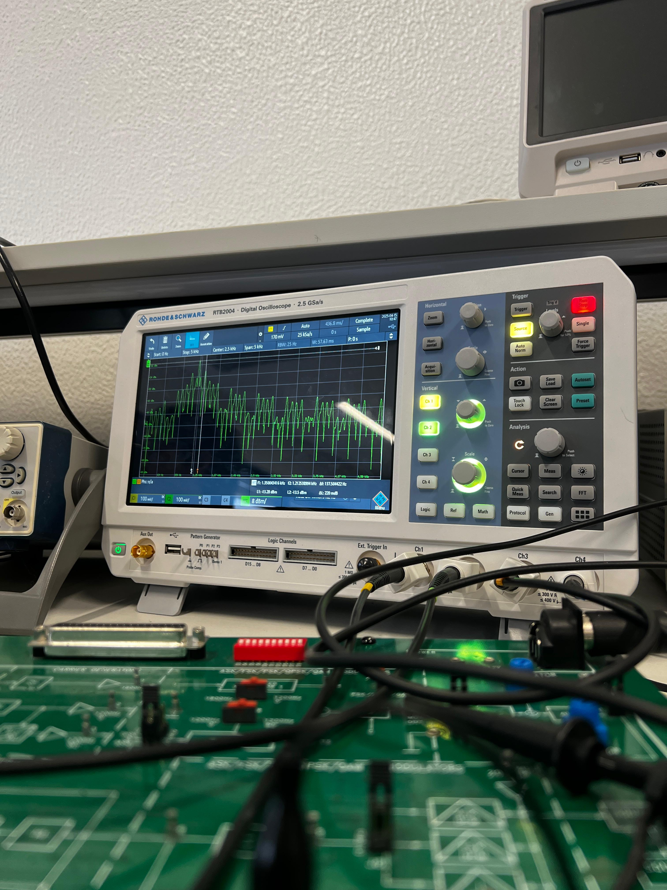

# Digital Modulation and Demodulation — Lab Reports (TP1, TP2, TP3)

Three practical laboratory reports covering digital baseband transmission, single-symbol digital modulation (ASK, PSK, CPFSK), and multi-symbol QPSK modulation and demodulation. All experiments were carried out using the Rohde & Schwarz RTB2004 oscilloscope and dedicated hardware modules (MCM31, CE kit, ADALM-Pluto SDR).

Developed for the Digital Communications course — University of Aveiro (DETI), 2024/25.


---

## Table of Contents
- [About the Project](#about-the-project)
- [TP1 — Baseband Digital Transmission](#tp1--baseband-digital-transmission)
- [TP2 — ASK, PSK and CPFSK Modulation](#tp2--ask-psk-and-cpfsk-modulation)
- [TP3 — QPSK Multi-Symbol Modulation and Demodulation](#tp3--qpsk-multi-symbol-modulation-and-demodulation)
- [Equipment](#equipment)
- [Key Results Summary](#key-results-summary)
- [File Structure](#file-structure)
- [Authors](#authors)

---

## About the Project

This repository brings together the reports from three connected lab sessions on digital communications. Each builds on the previous: starting from the fundamentals of baseband coding and line codes, through single-carrier digital modulation schemes, and finishing with a full QPSK transmitter/receiver chain including carrier recovery, symbol synchronisation, and SDR-based reception.

---


## TP1 — Baseband Digital Transmission

**Topic**: Digital transmission in baseband — signals transmitted without modulation.

**Objectives**:
- Analyse different line coding schemes and their waveforms
- Study how the transmission channel affects signal quality
- Understand how to improve transmission efficiency and reliability

**Key concepts covered**: NRZ, RZ, Manchester encoding, inter-symbol interference (ISI), eye diagrams, noise margin, clock recovery from line codes.

---

## TP2 — ASK, PSK and CPFSK Modulation

**Module**: MCM31

**Topic**: Single-symbol digital modulation — amplitude, phase, and frequency shift keying.

**Objectives**:
- Study ASK, PSK, and CPFSK modulation and demodulation using the MCM31 module
- Analyse the effect of different line codes on the quality of the recovered clock signal at the receiver
- Observe and compare the modulated waveforms and their spectra on the oscilloscope

**Key concepts covered**: ASK envelope detection, PSK coherent demodulation, CPFSK continuous phase, clock extraction quality vs line code choice.

---

## TP3 — QPSK Multi-Symbol Modulation and Demodulation

**Report file**: `TP3T5G1.pdf`
**Module**: CE QPSK kit + ADALM-Pluto SDR + GNU Radio

**Topic**: QPSK modulation and demodulation — 2 bits per symbol, I/Q architecture.

### Part 1 — Hardware QPSK (CE kit)

**Information mapping (section 4.1)**

- Serial-to-parallel conversion: Data (TP4) split into I component (TP6, even bits) and Q component (TP7, odd bits)
- Symbol duration is twice the bit duration: ratio Signal6 / Signal4 = 1650/780 = 2.11

**QPSK Transmitter (section 4.3)**

- Carrier phase difference between TP12 and TP13: -87.43 deg (approx. -90 deg — confirms I/Q orthogonality)
- Modulated I branch: x14 = I(t) * A*cos(2*pi*fp*t)
- Modulated Q branch: x15 = Q(t) * A*sin(2*pi*fp*t)
- Measured constellation phases:

| Symbol | Measured phase | Theoretical phase |
|---|---|---|
| 00 | +134.48 deg | +135 deg |
| 01 | -124.43 deg | -135 deg |
| 10 | +47.26 deg | +45 deg |
| 11 | -43.28 deg | -45 deg |

**QPSK Receiver (section 4.4)**

- Phase offset between TP20 and TP16: 25.07 deg
- Phase offset between recovered carriers TP22 and TP21: 90.24 deg (confirms I/Q separation)
- Phase ambiguity demonstrated: pressing Phase Sync causes phase to shift between 0, +/-90, and 180 deg
- Differential mode (SW2 = Differential): transmitted and received signals stay aligned regardless of Phase Sync presses
- TP23/TP25 — digital regenerated I/Q signals (after Clock Recovery & Data Formatting)
- TP24/TP26 — analogue low-pass filtered I/Q signals (baseband, before decision)

### Part 2 — SDR QPSK Reception (ADALM-Pluto + GNU Radio)

**Frequency offset correction (section 3.2)**

Pilot reference: f_ref = 175 kHz; carrier: fp = 860 MHz; received pilot: f_rec = 164.28 kHz

```
p = (f_rec - f_ref) / (fp + f_ref) * 1e6 = -12.46258 ppm
```

**Symbol and bit rate (section 3.3.1)**

Roll-off factor F = 50%, bandwidth LB = 300 kHz:

```
r_s = 2 * LB / (1 + F) = 400 Ksymbols/s
r_b = 2 * r_s = 800 Kbits/s        (2 bits/symbol for QPSK)
```

**Carrier Synchronizer (section 3.3.2)**

- Before synchronisation: constellation forms a rotating ring (phase ramp due to frequency offset)
- After synchronisation: four stable clusters at expected QPSK positions
- Signal model before sync: Z_B = |Z_B| * exp(-j*phi), phi = Delta_omega * t
- Signal model after sync: Z_C = |Z_B| = x(t)/2

**Eye diagram (section 3.3.3)**

- Before Carrier Synchronizer: closed eye, high jitter, small ISI opening, low noise margin
- After Carrier Synchronizer: open eye, reduced jitter, larger ISI opening, better noise margin

**Symbol Synchronizer (section 3.3.4)**

After temporal synchronisation, constellation symbols cluster tightly around the four ideal QPSK points, confirming successful synchronisation.

**Decoded output (section 3.3.5)**

Successfully decoded repeated "Hello world" packets (frames 038--057).

---

## Equipment

| Equipment | Model | Purpose |
|---|---|---|
| Oscilloscope | Rohde & Schwarz RTB2004 | Waveform capture, FFT, phase measurement |
| QPSK hardware module | CE kit (MCM31-based) | Transmitter and receiver chain for TP2/TP3 |
| SDR transceiver | ADALM-Pluto | RF transmission and reception at 860 MHz |
| Software | GNU Radio | SDR signal processing chain (carrier sync, symbol sync, decoding) |

---

## Key Results Summary

| Experiment | Key Result |
|---|---|
| TP1 — Baseband | Eye diagram quality varies with line code; clock recovery depends on transitions |
| TP2 — ASK/PSK/CPFSK | CPFSK has best clock recovery; PSK requires coherent demodulation |
| TP3 — QPSK constellation | Measured phases match theory within ~0.5 deg error |
| TP3 — Phase ambiguity | Phase Sync causes 0 / +/-90 / 180 deg rotation without differential coding |
| TP3 — SDR frequency offset | Correction factor p = -12.46 ppm applied to ADALM-Pluto |
| TP3 — Bit rate | 800 Kbits/s at 400 Ksymbols/s with F=50% raised cosine filter |
| TP3 — Carrier sync effect | Constellation rotates before sync; stable 4-point cluster after sync |

---

## File Structure

```
digital-modulation-lab/
├── TP3T5G1.pdf              -- Full report: QPSK modulation and demodulation (TP3)
├── 6_1_1.png                -- Oscilloscope capture: baseband waveforms
├── 6_1_2.png                -- Oscilloscope capture: modulated signal time domain
├── 6_1_3_sinal_14_.png      -- Oscilloscope capture: signal at TP14 (I branch modulated)
├── 6_1_4_-20dBs_.png        -- FFT spectrum capture at -20 dBm reference
├── 6_2_2.png                -- Oscilloscope capture: multi-channel view (I, Q, data, output)
└── README.md
```

> TP1 and TP2 full reports are not included in this repository due to file size. Their scope is summarised in this README.

---

## Authors

- Bruno Marques — 113529
- Edson Come — 115640

**Course**: Comunicacoes Digitais — Turma P5, Grupo 1, LEEComp, University of Aveiro
**Academic Year**: 2024/25
**Date**: 30 May 2025
